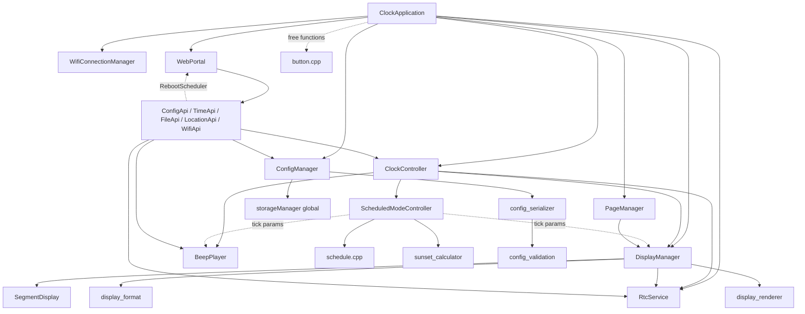

# Design Review — Current State

*Snapshot of the design as found on 2026-09-29. It describes; it does not
recommend. [CLAUDE.md](../CLAUDE.md) remains the maintained reference — where
this document and CLAUDE.md disagree, section 4.2 calls it out.*

---

## 1. What the application does

Firmware for a desk clock built on a Wemos D1 Mini (ESP8266):

- three TM1637 4-digit 7-segment panels,
- a battery-backed DS3231 RTC whose 1 Hz square wave (SQW) drives the main tick,
- an active-low buzzer driven through an NPN buffer on the D8 strapping pin
  ([WIRING.md](../WIRING.md)),
- one push button on D3,
- WiFi, as a station or as its own access point with a captive portal and a web UI.

Pin assignments live in [src/hardware.h](../src/hardware.h).

### Modes

The persisted `Mode` enum is in [src/config.h](../src/config.h).

| Mode | What the panels show |
|---|---|
| Countdown | Time remaining to a configured end datetime, then the final message |
| Countup | Time elapsed since a configured start datetime |
| Clock | Wall-clock time in one of 19 layouts, 12 or 24 hour |
| Friday | Clock from Saturday sunset to Friday midnight, then a countdown to Friday sunset, then a countdown to Saturday sunset |
| Trading | Countdown through one or two weekday sessions: open, close, then the next weekday's first open |

### User-facing flows

- **Power-on.** A splash message, then the configured mode. If the RTC is
  missing or reports a low battery, a fault overlay takes over.
  See `ClockApplication::begin` and `ClockApplication::reportInitialRtcStatus`
  in [src/clock_application.cpp](../src/clock_application.cpp).
- **Button.** Handled by `handleButtonEvent` in `clock_application.cpp`, with
  debouncing and the event queue in [src/button.cpp](../src/button.cpp).
  - Single press: pages the network SSID across the panels.
  - Double click: pages the IP address.
  - Long press: logs RTC status to the serial monitor only; nothing appears on
    the panels.
- **Web UI.** Eleven static pages, with routes defined in
  [tools/web_manifest.py](../tools/web_manifest.py):

  | Page | Purpose |
  |---|---|
  | `/` | Home |
  | `/format` | Mode and display settings |
  | `/settings` | Settings menu |
  | `/time` | RTC sync and timezone |
  | `/sunset` | Sunset calculator |
  | `/messages` | Display messages |
  | `/sound` | Beep settings and preview |
  | `/location` | Device location |
  | `/wifi` | Network settings |
  | `/files` | File manager |
  | `/view` | File viewer |

  Every page talks to the device through JSON APIs.
- **Scheduled announcements.** When the clock crosses a boundary live, it
  blinks that boundary's message for 5 seconds and can play an optional short
  beep. Before selected boundaries, an approach alert plays: four phases, each
  beeping twice as fast as the one before, ending exactly on the boundary.
  See [src/scheduled_mode.cpp](../src/scheduled_mode.cpp) and
  [src/beep_pattern.cpp](../src/beep_pattern.cpp).
- **Fault display.** `ClockApplication::checkRtcHealth` runs every 2 seconds
  and shows or clears the "no rtc" and "LO BAT" overlays.

---

## 2. Architecture

### 2.1 Composition root

[src/main.cpp](../src/main.cpp) holds one global `ClockApplication` and forwards
`setup()` and `loop()` to it.

`ClockApplication` ([src/clock_application.h](../src/clock_application.h))
creates and owns these services as members, in this order:

1. `SegmentDisplay`
2. `BeepPlayer`
3. `RtcService`
4. `DisplayManager`
5. `ClockController`
6. `ConfigManager`
7. `PageManager`
8. `WifiConnectionManager`
9. `WebPortal`

Its constructor passes each service the others it needs, as references to
concrete classes, not interfaces. The one interface in the codebase is
`RebootScheduler` ([src/reboot_scheduler.h](../src/reboot_scheduler.h)):
`WebPortal` implements it so that the API handlers it owns can request a reboot
without depending on `WebPortal` itself.

### 2.2 Layers

| Layer | Modules | Responsibility |
|---|---|---|
| Hardware drivers | `rtc_ds3231`, `display`, `beep_player`, `button`, `hardware`, `storage_manager` | I2C/SQW, TM1637 writes with a segment cache, PWM tone, debounce, pin map and I2C scan, LittleFS mount |
| Pure logic (host-tested) | `schedule`, `display_format`, `datetime_validation`, `beep_pattern` | Boundary math, format catalog and renderers, calendar parsing, beep envelope |
| Pure logic (not host-tested) | `display_renderer`, `sunset_calculator` (math around SolarCalculator), `config_validation` | Overlay frames, local sunset, sanitizers |
| Application state | `ClockController`, `ScheduledModeController`, `DisplayManager` (+ `DisplayScheduler`), `PageManager` | Mode resolution, countdown completion, schedule tracking, View/Overlay model, render cadence |
| Persistence | `ConfigManager` ([src/config.cpp](../src/config.cpp)), `config_serializer`, `defaults`, `config_validation` | Cached config, JSON schema in both directions, factory defaults, crash-safe writes |
| Web | `WebPortal`, `HttpResponder`, `ConfigApi`, `TimeApi`, `FileApi`, `LocationApi`, `WifiApi` | Routing, captive portal, request diagnostics, endpoint domains |
| Frontend | `web/pages/*.html`, `web/common.js`, `web/common.css` (~1,950 lines, vanilla JS) | Forms over the JSON APIs |
| Build tooling | `tools/*.py` | Code generation and build-time validation |

The "host-tested" group is exactly what `build_src_filter` compiles in
`[env:native]` in [platformio.ini](../platformio.ini).

### 2.3 Dependencies



What the diagram encodes:

- **Dashed "tick params" edges.** `ScheduledModeController` gets
  `DisplayManager` and `BeepPlayer` as arguments to `tick()`, not through its
  constructor.
- **Web-layer routing.** The web handlers make live changes through
  `ClockController` and persist through `ConfigManager`.
- **Direct beep previews.** `ConfigApi` calls `BeepPlayer` directly for
  previews (see the comment in
  [src/clock_controller.h](../src/clock_controller.h)).
- **Button bypasses the controller.** Button events reach `PageManager` and
  `WebPortal::getNetworkInfo` without going through `ClockController`.

---

## 3. Data flows

### 3.1 One RTC second, from interrupt to digits

This is the core loop. It runs on every `loop()` pass, and does real work once
per accepted SQW edge.

1. **ISR.** `onRtcSqwPulse` ([src/rtc_ds3231.cpp](../src/rtc_ds3231.cpp))
   records `millis()` as `isrCounters.edgeAtMs` and increments the pending and
   lifetime counts.
2. **Loop entry.** `ClockApplication::tick` calls `buttonTick` and
   `processButtonEvents`, then `RtcService::consumeSqwPulse`.
3. **Pulse consumption.** `consumeSqwPulse` does, in order:
   - snapshots and clears the counters with interrupts disabled;
   - rejects an edge that is stale (at least `kSqwPulseStaleMs` old) or that
     came less than 500 ms after the last accepted one;
   - flags a discontinuity when any of these holds: a resync was pending, this
     is the first pulse, more than one pulse was queued, or the gap was over
     1500 ms;
   - on a discontinuity or at :00/:30, re-reads the chip over I2C. If a new edge
     arrived during that read, it backs off and resyncs on the next loop;
   - otherwise advances `m_cachedNow` by one second;
   - returns an `RtcTick {now, secondStartedAtMs, discontinuity}`.
4. **Controller.** `ClockController::onSecondBoundary`
   ([src/clock_controller.cpp](../src/clock_controller.cpp)):
   - at the top of each hour, calls `DisplayManager::notifySecondBoundary(true)`,
     which triggers `SegmentDisplay::invalidateCache` (the next frame rewrites
     every digit);
   - on a discontinuity, calls `ScheduledModeController::reset` and
     `BeepPlayer::cancelBoundaryAlert`;
   - then runs `refreshSchedule` → `ScheduledModeController::tick`, followed by
     `updateCountdown`.
5. **Schedule.** `ScheduledModeController::tick`:
   - `refreshSunsets` updates the weekly sunset cache (Friday mode only);
   - `crossedBoundary` decides whether a boundary was crossed live: at most 5 s
     late, with no other boundary skipped;
   - `evaluate` calls the pure `evaluateFridaySchedule` or
     `evaluateTradingSchedule` ([src/schedule.cpp](../src/schedule.cpp));
   - if the decision changed, `DisplayManager::setView(viewFor(decision))`;
   - on a live crossing, `showInfo(message, 5000)` plus an optional
     `BeepPlayer::beep`;
   - finally `patternFor` → `BeepPlayer::updateBoundaryAlert` or
     `cancelBoundaryAlert`.
6. **Countdown completion.** `updateCountdown` sets
   `DisplayManager::setCountdownComplete` for ordinary Countdown mode. It beeps
   only on a live, non-discontinuous second.
7. **Render.** Later in the same loop, `DisplayManager::tick`
   ([src/display_manager.cpp](../src/display_manager.cpp)) expires any finished
   overlay, then calls `render`. `render` chooses, in priority order:
   - the active overlay;
   - the countdown-complete message;
   - the base view, after advancing the view-blink phase if a blink window is
     active.
8. **Frame building.** `buildClockFrame`, `buildCountdownFrame`, and
   `buildCountupFrame`:
   - throttle through `DisplayScheduler::shouldRender` (100 ms for tenths
     formats, 1 s otherwise);
   - read `RtcService::getNowCached` (no I2C) and `msIntoSecond` (tenths
     locked to the ISR edge);
   - call `renderClockFormat` or `renderCountingFormat`
     ([src/display_format.cpp](../src/display_format.cpp)), which interpret the
     format's `PanelSpec` shapes in `renderPanels`.
9. **Output.** `SegmentDisplay::showFrame`
   ([src/display.cpp](../src/display.cpp)) converts characters to segments via
   `kAsciiSegments` (PROGMEM). It writes only the panels whose segments differ
   from `m_lastSegments`.

Also in the loop: `BeepPlayer::tick` works out the current PWM pulse from
absolute start times, so a slow loop skips beeps rather than delaying them.
`WifiConnectionManager::tick` and `WebPortal::handleClients` run afterwards.

### 3.2 Saving settings from a page (`POST /api/config`)

1. **Browser.** A page calls `apiPost` ([web/common.js](../web/common.js)) with a
   partial JSON document.
2. **Routing.** `WebPortal` ([src/web_server.cpp](../src/web_server.cpp)) routes
   to `ConfigApi::handleSaveConfig`
   ([src/config_api.cpp](../src/config_api.cpp)).
3. **Parse.** `HttpResponder::parseJsonBody` deserializes the body; malformed
   JSON is answered with a 400 there.
4. **Apply clock settings.** The handler copies the cached `ClockConfig` and
   calls `applyJsonToClockConfig`
   ([src/config_serializer.cpp](../src/config_serializer.cpp)). This patches
   only the fields present; format selections resolve by key through
   `applyFormatField`. On the first invalid value, the handler returns 400 and
   throws the copy away.
5. **Apply WiFi settings.** `applyJsonToWifiConfig` patches a copy of the
   `WifiConfig` and reports whether anything changed.
6. **Persist.** `ConfigApi::persistClockConfig`:
   - first `resolveCountupStart` replaces the `"now"` sentinel with the current
     time, but only if `RtcService::timeIsTrustworthy()`;
   - then `ConfigManager::saveConfig` sanitizes (`sanitizeClockConfig`,
     `sanitizeWifiConfig`) and runs `writeAll`;
   - `writeAll` goes `serializeToTemp` → `verifyTemp` (re-parse) →
     `installVerifiedTemp` (backup the old file, rename the temp over it,
     restore the backup on failure);
   - only after a successful write does the in-RAM cache `m_current` change.
7. **Apply live.** `ClockController::applyConfig` sets volume and flags,
   resolves `initialView`, calls `DisplayManager::applySettings` (which keeps a
   hardware fault but drops any other overlay), and refreshes the schedule and
   countdown.
8. **Respond.** If WiFi changed, the response is a reboot message and
   `RebootScheduler::scheduleReboot(1500)` is called; the reboot fires in
   `WebPortal::handleClients`. Otherwise the response is the canonical
   serialized config plus `"message":"Saved"`.

`POST /api/mode` (`ConfigApi::handleSetMode`) is the other writer. It goes
through the same `persistClockConfig` → `applyConfig` path.

### 3.3 Boot and config load

1. **Serial and banner.** `ClockApplication::begin` starts Serial at 74880,
   then logs device info and the build stamp.
2. **RTC.** `initializeRtc`:
   - `Wire.begin(SDA, SCL)` at 100 kHz;
   - `RtcService::begin`: probe 0x68, `RTClib::begin`, seed `m_cachedNow`,
     provisionally set `timeTrusted`, install the log time provider;
   - `recoverIfPowerWasLost`: after power loss, sets the chip to the build date
     and clears `timeTrusted`;
   - `flagInvalidTimeIfNeeded`, then set SQW to 1 Hz;
   - `beginSqwProcessing` attaches the RISING interrupt;
   - `i2cBusScanner.scan()` logs every device on the bus.
3. **Display and config.** `initializeDisplayAndConfig`:
   - the first `ConfigManager::clockConfig()` call triggers the lazy
     `ensureLoaded`;
   - `ensureLoaded` fills defaults with `initDefaultClockConfig`
     ([src/defaults.cpp](../src/defaults.cpp)), then `readAll`;
   - `readAll` tries `/config.json`, then `/config.bak`, applying each as a
     patch over the defaults. It writes defaults to disk only when both files
     are absent; unreadable files are left alone;
   - then `SegmentDisplay::begin`, `BeepPlayer::begin`, `applyConfig`, and the
     splash overlay.
4. **Faults.** `reportInitialRtcStatus` shows a fault overlay if needed.
5. **Network.** `WifiConnectionManager::begin` tries station mode for 15 s,
   otherwise starts the access point. `WebPortal::begin` starts captive DNS
   (AP mode only), registers the generated assets and API routes, and starts
   the server.
6. **Last.** `buttonBegin`, then the optional startup beep. The beep comes
   after WiFi on purpose, because WiFi setup blocks the loop.

---

## 4. Technologies, frameworks, and patterns

### 4.1 Stack

**Firmware**
- PlatformIO with the Arduino ESP8266 core, on a `d1_mini` board.
- Libraries: RTClib, ArduinoJson 7, OneButton, SolarCalculator, TM1637
  (`lib_deps` in [platformio.ini](../platformio.ini)).
- LittleFS for storage; ESP8266WebServer and DNSServer for the web side.
- Build flags `-Wall -Wextra`; `-Wno-deprecated-copy` for C++ only, via
  [tools/cxx_flags.py](../tools/cxx_flags.py).

**Tests**
- Unity on `[env:native]` with `-Werror`.
- [test/stubs/](../test/stubs) stands in for `Arduino.h` and RTClib's `DateTime`.
- Four suites: beeps, datetime, formats, schedule.

**Build-time code generation and checks** (PlatformIO pre-scripts)
- [tools/check_formats.py](../tools/check_formats.py): parses the C++ format
  tables and fails the build on catalog errors.
- [tools/build_web.py](../tools/build_web.py): gzips `web/` into
  `generated_web_assets.h` (PROGMEM), with a content hash in the URLs of the
  shared assets.
- [tools/build_zipcodes.py](../tools/build_zipcodes.py): builds the binary
  `/zipcodes.bin` index from `assets/zipcodes.csv`.

**Developer tools**
- [tools/dev_server.py](../tools/dev_server.py) serves the raw `web/` sources
  and proxies `/api/*` to a live device.
- [tools/probe_pages.ps1](../tools/probe_pages.ps1) fetches every route over and
  over and sorts failures into classes (transport error, HTTP status, truncated
  HTML), turning intermittent WiFi page-load problems into a failure rate.

**Frontend**
- Plain HTML and vanilla JS, no framework.
- Shared helpers in `web/common.js`: `$`, `api`, `apiPost`, `setStatus`,
  `reportFieldMismatch`, `setFieldFromConfig`, and error beacons to
  `POST /api/client-log`.

### 4.2 Patterns in use, and where they are inconsistent

| Pattern | Where it holds | Where it breaks |
|---|---|---|
| Services are members of `ClockApplication` ("owns every stateful service", [README.md](../README.md)) | All nine classes in 2.1 | Globals: `ButtonController controller` in `button.cpp`; `storageManager` ([src/storage_manager.cpp](../src/storage_manager.cpp)); `i2cBusScanner` ([src/hardware.cpp](../src/hardware.cpp)); `activeManager` ([src/wifi_connection_manager.cpp](../src/wifi_connection_manager.cpp)); `loggingInstance` and `isrCounters` (`rtc_ds3231.cpp`) |
| "The only file-static state in `rtc_ds3231` is the ISR counters" (CLAUDE.md and the `RtcService` class comment) | `isrCounters` | `loggingInstance` is a second file-static |
| Collaborators come in through the constructor | Every class in 2.1 and the five API classes | `ScheduledModeController::tick(…, DisplayManager&, BeepPlayer&)`; `WifiConnectionManager::connectAndSave(ConfigManager&, …)` |
| Sanitizers live in `config_validation` (CLAUDE.md: "Do not redeclare these elsewhere") | The per-value sanitizers | `sanitizeFormatFields`, `sanitizeMessageFields`, `sanitizeSoundFields` are in `config_serializer.cpp`; `ConfigManager::sanitizeClockConfig` is in `config.cpp` |
| JSON is built with ArduinoJson | Config, formats, status, sound, WiFi | `TimeApi::handleGetTime` ([src/time_api.cpp](../src/time_api.cpp)) formats JSON with `snprintf`; several handlers send fixed JSON string literals |
| Deadlines use an explicit flag, not a zero timestamp, and wraparound-safe comparisons | `DisplayScheduler`'s `m_renderInvalidated`; `DisplayManager::overlayExpired` (`< 0x80000000UL`) | `WebPortal` uses `m_pendingRebootMs != 0` as its "no reboot pending" marker; `WebPortal` and `button.cpp` compare with `static_cast<long>(millis() - deadline) >= 0` instead |
| Fixed buffers instead of `String` on hot or long-lived paths | `RtcStatus`, config structs, overlays, log macros | `WifiConfig`, `WifiRuntimeStatus`, `FileApi` paths, `WebPortal::handleClientLog`, and `getNetworkInfo` use `String` |
| Formatting: 2-space indent, indented access specifiers | Most files | 4-space in `config.cpp` and `defaults.cpp`; mixed 4/2-space inside `web_server.cpp` functions; tabs in `hardware.h`; unindented `public:` in `button.cpp`, `display.h`, `hardware.h` |
| `data/config.json` restates nothing from `defaults.cpp` (CLAUDE.md rule) | `countdown.end` is absent | It restates brightness, the splash and final messages, all three format keys, and the whole `sound` block |
| Captive portal addressing | DNS answers with `WiFi.softAPIP()` | `WebPortal::handleCaptiveRedirect` hardcodes `http://192.168.4.1/` |
| Code comments describe the current design | Nearly everywhere | `src/clock_controller.h` ("turned this class into a service locator") and the `RtcService::msIntoSecond` comment ("the old millis()-phase behavior") still describe past code |

**Doc/code mismatch.** CLAUDE.md says `notifySecondBoundary()` "invalidates the
render throttle on each accepted SQW pulse". In the code,
`DisplayManager::notifySecondBoundary` only invalidates the hardware segment
cache, and only when `forceHardwareRefresh` is true. `ClockController::setTime`
calls it with the default `false`, so that call does nothing.

### 4.3 Patterns applied consistently

**Pure logic separated from I/O**
- Schedule math, the format catalog, the beep envelope, and datetime parsing
  do no I/O.
- The controllers own every side effect.

**Declarative display formats**
- Each `FormatSpec` is three `PanelSpec {Shape, primary, secondary}` entries.
- `RefreshRate` and `ColonAnimation` are derived from the shapes, never stored.

**Keys, not positions, for persisted choices**
- Format selections are saved as keys; table indexes exist only in RAM.

**JSON as a patch over defaults**
- Loading from disk and applying an API payload use the same function.

**Memory discipline for the ESP8266**
- Strings stay in flash: `PSTR` log formats, PROGMEM tables, `F()` literals.
- `ConfigManager` returns the config by reference to save stack.
- A `static_assert` enforces the `ClockConfig` size budget.

**State resolved at render time**
- `longFormatIndex` and `BlinkWindow` are re-tested on every frame, so they
  need no stored "crossed a boundary" state.

---

## 5. State, persistence, and external integrations

### 5.1 Runtime state owners

| Owner | State |
|---|---|
| ISR (`isrCounters`) | Pending pulse count, lifetime count, last edge time |
| `RtcService` | Cached time, last pulse and phase references, resync flag, `RtcStatus` (including `timeTrusted`) |
| `ClockController` | Active mode, countdown end, completion flag, whether the final beep is enabled |
| `ScheduledModeController` | Mode-specific settings, three `BoundaryCue`s, approach patterns, weekly sunset cache, previous decision and time |
| `DisplayManager` | `DisplaySettings` snapshot, `ViewState` base view, `OverlayState`, countdown-complete flag, `DisplayScheduler` cadence |
| `BeepPlayer` | Scheduled and temporary windows, override owner, armed target, suppression, current PWM pitch, volume |
| `SegmentDisplay` | Last-written segments for each panel |
| `ConfigManager` | Cached `DeviceConfig`, loaded flag |
| `WifiConnectionManager` | Config copy, resolved AP SSID, mode, deferred AP client connect/disconnect events |
| `WebPortal` / `HttpResponder` | Reboot deadline, traffic counters, per-request diagnostics |
| `button.cpp` (global) | OneButton driver, 8-slot event queue, boot-pin recheck |

### 5.2 Persistence

- **`/config.json`** is the whole device configuration. Writes go through the
  staging files `/config.tmp` and `/config.bak`. The format is versioned by
  `configVersion` (currently 1, `kConfigSchemaVersion` in
  [src/config_serializer.h](../src/config_serializer.h)). The only field-path
  spellings are in `config_serializer.cpp`.
- **`/zipcodes.bin`** is a read-only lookup table (164 KB, 33,100 records) used
  by `zipcodeLookupLocation` ([src/zipcode.cpp](../src/zipcode.cpp)). It is
  generated at build time and uploaded with `uploadfs`.
- **The DS3231** is persistent state in its own right: its battery-backed time
  survives power loss, and its oscillator-stop flag is how the firmware detects
  that power was lost.
- **Nothing else persists.** Schedule caches, overlays, and alert state are all
  rebuilt from config and time at boot.

### 5.3 External integrations

**Hardware**
- DS3231 over I2C (address 0x68), with SQW on GPIO13 as a RISING interrupt.
- TM1637 panels on a shared clock line with three data lines.
- PWM on GPIO15, through the NPN buffer.
- The button, through OneButton.

**Network**
- WiFi station mode, or an access point with a least-congested channel survey,
  802.11g, and 17 dBm transmit power (`WifiConnectionManager::startAccessPoint`).
- Captive-portal probe endpoints for Android, Apple, and Windows, registered in
  `WebPortal::begin`.

**The browser as a time source**
- The browser is the only source of wall-clock time and timezone.
- `/time` posts `/api/time` (sets the RTC through `ClockController::setTime`),
  then posts `/api/config` with `time.timezone`.
- There is no NTP and no cloud service.

**Sunset**
- `calculateSunset` wraps SolarCalculator. The input date is anchored at local
  18:00 before converting to UTC, and anything invalid falls back to 18:00 local.

---

## 6. Open questions

1. **Long-press button.** The RTC status goes only to the serial monitor. Is
   that meant as a bench-only diagnostic, or should it reach the panels like the
   SSID and IP pages?
2. **`notifySecondBoundary`.** Is the documented per-pulse invalidation of the
   render throttle the intent, or the current behavior: hardware-cache
   invalidation at the top of the hour only? Relatedly, is the call from
   `ClockController::setTime`, which does nothing, meant to force a redraw?
3. **Daylight saving time.** The UTC offset is a stored number that changes only
   when the browser syncs. Is a manual resync at each DST change the accepted
   workflow for Friday-mode sunset times?
4. **Time sync is two requests.** `/api/time`, then `/api/config`. If the second
   fails, the RTC is set but the timezone is not saved. Is that partial result
   acceptable?
5. **No RTC present.** `RtcService::getNow()` then returns 2000-01-01 00:00:00,
   and `GET /api/time` reports that date to the browser. Is that the intended
   signal?
6. **`assets/songs/`** is an empty, untracked directory left over after the
   sounds were removed. Is it expected to stay?
7. **`data/config.json`** restates values from `defaults.cpp`, against the
   CLAUDE.md rule. Is that deliberate, for example to show the file's shape to
   someone editing it by hand?
8. **Authentication.** No endpoint is authenticated, which CLAUDE.md and
   AGENTS.md record as an open decision. The access-point password
   (`12345678` by default) is currently the only protection when the device is
   in AP mode.
9. **Captive redirect.** Is the hardcoded `192.168.4.1` in the redirect an
   intentional assumption (the ESP8266's default AP address), given that the
   DNS side reads `WiFi.softAPIP()`?

---

## 7. Critical assessment

*Added 2026-09-29. Every problem below was confirmed in the code, not inferred
from documentation. Severity is how badly the problem hurts when it happens.
Growth risk is how likely it is to hurt more as the firmware gains features,
modes, or settings.*

### 7.0 The short list

These are the problems that matter most, in priority order.

| # | Problem | Kind | Severity | Growth risk |
|---|---|---|---|---|
| 1 | The clock never adjusts for daylight saving time: it shows the wrong hour for part of every year until someone re-syncs from a browser | Design flaw | **High** | Certain; it happens twice a year |
| 2 | After a power cut, the clock can boot faster than the router, fall back to AP mode, and never retry the home network | Design flaw | **High** | Likely on every whole-house outage |
| 3 | In that fallback AP mode, anyone nearby can take full control using the published default password | Design flaw | **High** (compounded by #2) | Grows with every endpoint added |
| 4 | The riskiest logic has no tests: pulse handling, boundary crossing, render priority, config parsing | Design flaw | **Medium-High** | Grows with every mode and setting |
| 5 | Web requests block the single loop, so the display and beeps freeze while a request is handled | Design flaw | **Medium** | Grows with every endpoint and log line |
| 6 | File upload and delete write `/config.json` behind `ConfigManager`'s back, so the next save silently undoes the change | Design flaw | **Medium** | Stable, but surprising |
| 7 | APIs report success when they did nothing | Design flaw | **Medium** | Grows with every handler |

Everything else below is medium or low, and section 7.9 lists the items that
are style or preference rather than design.

---

### 7.1 Architecture

**Working well; keep**
- **One composition root.** `ClockApplication` builds and wires everything,
  with no service locator and no hidden construction. You can read the whole
  object graph in one constructor.
- **The RTC's 1 Hz square wave drives time.** Handling it in
  `RtcService::consumeSqwPulse` makes the display, schedules and beeps agree
  on the same second. The handling of stale edges, backlogs, and edges that
  arrive during an I2C read is careful work that most hobby clocks get wrong.
- **The Mode → View + Overlay model** (`display_manager.h`). Overlays don't
  save a copy of the view underneath, so nothing can restore a stale view.
  The absence of that state is the right design.
- **A pure core.** Schedule math, the format catalog, the beep envelope and date
  parsing touch no hardware, which is what makes them testable at all.

**Problems**

1. **No daylight saving handling at all.** *(High; certain.)*
   - The RTC stores *local* wall-clock time, and the timezone is a single stored
     number (`TimezoneConfig::utcOffsetMinutes` in `src/config.h`). No code
     mentions DST.
   - When the clocks change, the displayed time is wrong by an hour until
     someone opens `/time` and syncs. On a clock, that is the one failure a user
     cannot miss.
   - It also shifts every scheduled boundary, because `schedule.cpp` works in
     local seconds taken from that same RTC. Trading opens and Friday sunsets
     would announce an hour off.
   - The root cause is a data-model decision (local time stored, rules not
     stored), covered further in 7.3. A time-sync feature alone does not
     remove it.

2. **No network recovery.** *(High; likely.)*
   - `WifiConnectionManager::begin` gives station mode one 15-second attempt,
     then calls `startAccessPoint()` and stays there. `tick()` only logs AP
     client events; nothing ever retries the station connection.
   - After a whole-house power cut, the ESP8266 is up in about 1 second while a
     typical router needs 1-3 minutes. The clock therefore boots into AP mode
     and stays unreachable on the home network until someone power-cycles it
     again.
   - The reverse case is also unrecoverable. In station mode the AP is off, so
     if the station credentials later become invalid (router password changed),
     auto-reconnect retries forever with no way in except a reboot.

3. **A single cooperative loop, with handlers that block it.** *(Medium;
   grows.)*
   - Everything runs inside `ClockApplication::tick`, which is the right model
     for this chip, but the web handlers are not written for it:
     - `WifiApi::handleScan` → `WiFi.scanNetworks()` blocks for about 2-4 s;
     - `ConfigApi::logConfigJson` pretty-prints about 1 KB to serial at
       74,880 baud, roughly 300 ms, on every settings page load;
     - `FileApi::logFileContent` mirrors up to 4 KB, roughly 0.5 s;
     - every config save writes flash inside the request.
   - While any of these runs, the display does not render, tenths freeze, and
     approach-alert beeps are skipped.
   - `consumeSqwPulse` handles the pulse backlog correctly afterwards, which
     hides the problem rather than preventing it. Each new endpoint or log line
     adds another stall.

4. **The browser is the only source of time.** *(Medium.)*
   - In station mode the clock has internet access but never uses NTP. Time
     accuracy therefore depends on a person remembering to open `/time`.
   - Together with problem 1, this makes the time's correctness a manual chore.

---

### 7.2 Modularity and coupling

**Working well; keep**
- **Constructor injection of concrete types.** The trade-off is documented
  (CLAUDE.md, *Design principles*) and fits a single-implementation firmware.
  The `RebootScheduler` interface is used exactly where a dependency cycle
  would otherwise exist.
- **One home for the JSON schema.** `config_serializer` owns every JSON field
  name, and `tools/check_formats.py` guards the format catalog, so field names
  are not scattered around the code.
- **Shared layouts.** `display_format`'s shape-driven rendering makes Countdown
  and Countup physically share their layouts.

**Problems**

1. **`ScheduledModeController` mixes decisions with side effects.** *(Medium;
   grows with every scheduled mode.)*
   - `ScheduledModeController::tick` (`src/scheduled_mode.cpp`) decides whether a
     boundary was crossed, then directly calls `DisplayManager::setView`,
     `showInfo`, `BeepPlayer::beep` and `updateBoundaryAlert`. It receives those
     two classes as `tick()` arguments.
   - The crossing policy (at most 5 s late, never skip a boundary, stay silent
     after a discontinuity) is the most bug-prone logic in the firmware. It is
     welded to hardware-facing concrete classes, so it cannot run on the host.
   - CLAUDE.md says the two modes are deliberately not abstracted. That
     decision is fine for two modes. The branches on `m_mode` in `viewFor`,
     `patternFor` and `refreshSunsets` are where a third mode would hurt.

2. **The file API bypasses the config owner.** *(Medium.)*
   - `FileApi::handleUpload` and `handleDeleteFile` (`src/file_api.cpp`) accept
     `/config.json`. `isCredentialBearingPath` blocks only *reading* it.
   - An uploaded config is never loaded into `ConfigManager::m_current`. The
     next save from any page writes the cached copy over it, silently
     discarding the upload.
   - A deleted config is re-created on the next save, while the running device
     keeps using the old values until reboot.
   - Two writers to one file with only one of them holding the cache is a real
     consistency hole.

3. **Sanitization lives in three places.** *(Medium; grows with every config
   field.)*
   - `config_validation.cpp` holds the per-value clamps.
   - `config_serializer.cpp` holds `sanitizeFormatFields`,
     `sanitizeMessageFields` and `sanitizeSoundFields`.
   - `ConfigManager::sanitizeClockConfig` in `src/config.cpp` orchestrates them.
   - Adding one setting today touches the struct (`config.h`), `defaults.cpp`,
     the serializer in both directions, a sanitizer in one of three files, and
     at least one web page: six places, with nothing checking that all were
     updated.

4. **`ClockController` is half controller, half pass-through.** *(Low.)*
   - `showDemo`, `showInfo`, `showSplash`, `setBrightness`, `activeView` and
     `demoActive` just forward to `DisplayManager`. Its real work is
     `applyConfig`, `onSecondBoundary` and `setTime`.
   - It works, but the class boundary no longer says what it owns, so new
     features get routed through it by habit.

5. **Global singletons alongside injected objects.** *(Low.)* These are all
   globals rather than members of `ClockApplication`:
   - the button controller in `src/button.cpp`;
   - `storageManager`;
   - `i2cBusScanner`;
   - `activeManager` in `src/wifi_connection_manager.cpp`;
   - `loggingInstance` in `src/rtc_ds3231.cpp`.

   Each is defensible (a single pin, or a C callback that needs a plain
   function pointer). The cost is that README and CLAUDE.md claim otherwise,
   and new code copies whichever style it sees first.

---

### 7.3 Data model

**Working well; keep**
- **Selections stored by key.** Formats are saved by key (`displayFormatIndexForKey`),
  so the catalog can be reordered freely.
- **Patch semantics.** Loading from disk and applying an API payload go through
  the same function (`applyJsonToClockConfig`), so there is only one code path
  to get right.
- **Honest sentinels.** `kCountupStartNow` means "never set", and a count-up
  origin is stamped only when `timeIsTrustworthy()` says the clock is right.
- **Values decided at render time.** `longFormatIndex` and `BlinkWindow` carry
  no crossing state that could get stuck.

**Problems**

1. **Time is stored as local time with a fixed offset.** *(High; certain.)*
   - The RTC and every schedule use local seconds. `utcOffsetMinutes` is one
     number: it is a snapshot of the current offset, not a timezone.
   - This is the structural cause of 7.1-1. Correct DST behavior needs either
     UTC storage plus timezone rules, or at least the rules themselves.
   - The IANA timezone name is already stored (`TimezoneConfig::name`) but used
     for nothing.

2. **Message buffers are 5x larger than any message can be.** *(Low-Medium.)*
   - `kDisplayMessageLength` is 64 bytes, but `sanitizeDisplayMessage`
     (`src/config_validation.cpp`) caps every message at 12 characters,
     *including* leading spaces.
   - CLAUDE.md justifies the size with "the shipped messages use leading spaces
     to position text", but those spaces count toward the 12.
   - Ten such buffers exist. That is roughly 500 bytes of static RAM plus about
     250 bytes inside each stack copy of `ClockConfig`, on a chip that
     CLAUDE.md says must stay under 50% static RAM to leave room for
     over-the-air updates.
   - The 12-character cap itself is a local constant inside that function, so
     the web pages have to know it independently.

3. **C++ field names and JSON keys disagree.** *(Low.)* Examples:
   - `countdownDone` ↔ `final`;
   - `clockUse12Hour` ↔ `clock12Hour`;
   - `locations.device` ↔ `location`;
   - `locations.sunsetTest` ↔ `sunset`.

   The serializer keeps this safe, but every mismatch is something a reader
   must look up.

4. **Page scratch state is persisted as device configuration.** *(Low.)*
   `locations.sunsetTest` is the Sunset Calculator page's test input, and it
   lives in `/config.json` beside real settings.

5. **Schedules are fixed-capacity.** *(Low now, but it is the growth limit.)*
   - Trading allows two sessions, weekdays only, with no holidays.
   - Friday supports exactly two sunsets.

   Fine as a product scope. Extending either changes the struct, JSON, sanitizer,
   UI and the pure evaluator together.

---

### 7.4 Error handling

**Working well; keep**
- **Crash-safe config writes.** `ConfigManager::writeAll` writes a temp file,
  re-parses it, keeps a backup, and changes the in-RAM cache only after
  success. A corrupt file is never overwritten with defaults.
- **Fault presentation.** `checkRtcHealth` shows a fault overlay that takes
  priority over everything and clears itself when health returns.
- **Validation at the edge.** The API returns a precise 400 naming the first bad
  field, and throws away the partially applied copy.

**Problems**

1. **APIs report success when nothing happened.** *(Medium; grows.)*
   - `RtcService::setNow` returns `void` and simply logs "skipped" when no RTC is
     present. `TimeApi::handleTimeSync` then answers `{"message":"RTC synced"}`
     with status 200 regardless.
   - `WifiApi::handleConnect` answers **"SSID required"** (400) when the real
     failure was a flash write, because `connectAndSave` collapses two
     different failures into one `false`.
   - Neither is dramatic alone. The pattern of `void` or `bool` results that
     lose the reason is what makes the UI untrustworthy as more handlers are
     added.

2. **A failed time sync is half-applied.** *(Medium.)* The `/time` page sends
   two requests (`web/pages/time.html`): `/api/time` sets the RTC, then
   `/api/config` saves the timezone. If the second fails, the clock runs on new
   time with the old offset, and nothing tells the user which half failed.

3. **An absent RTC looks like a real date.** *(Low-Medium.)* With no RTC,
   `RtcService::getNow` returns 2000-01-01 00:00:00. `GET /api/time` sends that
   to the browser as the current time, with nothing marking it invalid. Only
   the persistence paths check `timeIsTrustworthy()`.

4. **Request bodies are unbounded.** *(Low-Medium.)*
   - `HttpResponder::parseJsonBody` deserializes `m_server.arg("plain")`, a
     `String` holding the entire request body. ArduinoJson 7's document then
     grows to fit.
   - Nothing limits body size. With about 40 KB of heap, one oversized POST can
     exhaust memory and crash the device instead of returning 413.

---

### 7.5 Testability

**Working well; keep**
- **Host tests that fail on warnings.** `[env:native]` uses `-Werror`, and it
  has already caught a real 32-bit versus 64-bit arithmetic bug.
- **Well-chosen tests.** The 56 tests cover the pure modules: schedule
  evaluation, format rendering, the datetime round-trip, and the beep envelope.
- **A deliberately small stub layer.** `test/stubs/` fakes just enough of
  Arduino and RTClib, which keeps the tests honest.

**Problems**

1. **The riskiest logic is exactly the untested logic.** *(Medium-High;
   grows.)* These have no automated coverage:
   - `RtcService::consumeSqwPulse`: backlog handling, rejection of edges less
     than 500 ms apart, deferral when an edge arrives during I2C, resync at :00
     and :30;
   - `ScheduledModeController::crossedBoundary` and `tick`: the at-most-5-seconds
     rule, skipped boundaries, silence after a discontinuity;
   - `DisplayManager::render` priority (overlay, then completion, then base
     view) and view-blink timing;
   - `BeepPlayer` priority (preview, then event beep, then approach pattern)
     and suppression;
   - `config_serializer`: patch semantics, legacy integer indexes, legacy
     array-only Trading JSON;
   - `ConfigManager`'s recovery sequence.

   CLAUDE.md is candid that validation is "primarily on-device". The practical
   effect is that any change to timing, scheduling or persistence can only be
   verified by watching real boundaries happen, some of which occur once a week
   (Friday sunset).

2. **Design choices block testing, beyond the Arduino dependency.**
   *(Medium.)*
   - Concrete injection means `ScheduledModeController` cannot be tested
     without a real `DisplayManager` and `BeepPlayer`.
   - `config_serializer` depends only on ArduinoJson (which is portable) and
     `config_validation`, yet it is excluded from `build_src_filter`. Its
     exclusion is a choice, not a technical limit.
   - The CLAUDE.md premise that "the logic worth substituting is already pure"
     does not hold for the two most intricate state machines.

3. **Tests don't run where the code is built.** *(Medium for developer
   experience.)* Host tests need WSL on the author's machine (Smart App Control
   blocks MinGW), plus a separate build directory to stop the two PlatformIO
   installs wiping each other. There is no CI (no `.github/`), so tests run
   only when someone remembers to.

---

### 7.6 Performance

**Working well; keep**
- **The render path is tight.**
  - It reads time from the cache (`getNowCached`), with no I2C.
  - It diffs segments per panel (`SegmentDisplay::showFrame`), so unchanged
    panels are not rewritten.
  - A throttle keeps the frame rate to what each format needs.
  - Tenths are locked to the interrupt edge.
- **Memory discipline.** Log formats in flash, PROGMEM tables, the config
  returned by reference, and a `static_assert` stack budget are all measured,
  not superstition. Every log line reports the stack high-water mark.
- **Static web assets.** Gzipped in flash with immutable caching for shared
  assets, so pages cost almost no heap to serve.

**Problems**

1. **Serial logging blocks the loop.** *(Medium; grows with every log line.)*
   - At 74,880 baud, one 80-character line takes about 10 ms once the UART
     buffer is full.
   - The `/api/config` body mirror costs about 300 ms on every settings page
     load; the file mirror up to about 500 ms.
   - Logging is synchronous in the same loop that renders tenths, so
     diagnostics directly cause visible stutter. The more observability is
     added, the worse it gets.

2. **Scanning for networks stalls the clock and can drop the phone.**
   *(Medium.)*
   - `WifiConnectionManager::scanNetworks` blocks for about 2-4 s.
   - In AP mode it also switches the radio to AP+station for the scan, which
     makes it leave the AP channel. That can drop the very phone that asked for
     the scan, and stalls the display and beeps meanwhile.

3. **Heap per request.** *(Low.)* A config save holds, at the same time:
   - the body as a `String`;
   - a `JsonDocument`;
   - a `ClockConfig` copy in the handler;
   - a `DeviceConfig` copy in `saveConfig`.

   Fine today, but the `static_assert` caps only the struct size, not this
   total.

---

### 7.7 Security

**Working well; keep**
- **Credentials not served back.** The station password is withheld from
  `/api/config` (`serializeWifiStatus`), and `GET /api/file` refuses
  `/config.json` (`FileApi::isCredentialBearingPath`).
- **Printable-only input.** Every free-text input goes through
  `sanitizePrintableText` before logging or storage.
- **An explicit threat model.** "Trusted LAN, authentication undecided" is
  written down rather than assumed.

**Problems**

1. **Fallback AP mode gives full control to anyone nearby.** *(High, because
   7.1-2 makes AP mode likely.)*
   - The default AP password `12345678` is in the public repo
     (`src/defaults.cpp`, `data/config.json`). The SSID pattern (`ESP_XXXXXX`)
     is recognizable.
   - In AP mode every endpoint is exposed without authentication, including:
     - writing new station credentials;
     - uploading or deleting any file, including `/config.json`;
     - reading the AP password back (`serializeWifiStatus` returns it).
   - "Trusted LAN" does not apply to an open-air AP.

2. **Any web page can reconfigure the clock (cross-site request forgery).**
   *(Medium; likelihood low at home.)*
   - No handler checks `Content-Type`, `Origin`, or a token.
     `parseJsonBody` parses the body regardless of content type.
   - So a web page on any site can send a "simple" `text/plain` POST to
     `http://<clock-ip>/api/config`. The browser sends it without a CORS
     preflight, and the clock applies it: WiFi credentials, mode, or a reboot.
   - A multipart form POST to `/api/file/upload` can replace `/config.json` the
     same way.
   - This needs the clock's IP, which on a home LAN is guessable.

3. **Plaintext secrets.** *(Low.)* The station password sits in plain text on
   the flash, which is expected for this class of device. Serving is blocked,
   but `/api/file/upload` and `DELETE /api/file` can still replace or remove
   the file that holds it.

---

### 7.8 Developer experience

**Working well; keep**
- **Live page editing.** `tools/dev_server.py` edits pages against a live device
  with no reflash, which is a real productivity win.
- **Build-time guards and generators.** `tools/check_formats.py` catches
  catalog mistakes before they compile. `tools/build_web.py` and
  `tools/build_zipcodes.py` make generated artifacts reproducible and
  self-verifying.
- **Informative logs.** Every line carries time, stack high-water mark and
  source location, and `tools/probe_pages.ps1` turns "the page sometimes
  breaks" into a measurable failure rate.
- **Documentation records the reasons.** CLAUDE.md captures *why*, including
  evidence dates for the radio settings.

**Problems**

1. **The docs are already drifting from the code.** *(Medium; certain to get
   worse.)*
   - CLAUDE.md is about 300 dense lines, and AGENTS.md restates much of it.
   - Both have already drifted: `notifySecondBoundary`'s documented behavior is
     wrong (section 4.2), and the "only file-static state" claim is false.
   - With two long prose documents describing the same code, mismatches
     accumulate silently, and the documents are trusted precisely because they
     are so detailed.

2. **Adding a setting costs about six files, with nothing to catch an omission.**
   *(Medium; grows.)* See 7.2-3. `check_formats.py` protects formats only;
   nothing verifies that a new config field has a default, serializes in both
   directions, is sanitized, and appears in the UI.

3. **Toolchain friction.** *(Low-Medium.)* The workflow needs two PlatformIO
   installs, WSL, and `PLATFORMIO_BUILD_DIR`, plus the knowledge not to run
   `pio run` from WSL. This is well documented, but it is a trap for any
   second contributor.

---

### 7.9 Style or preference, not design flaws

These are real but cosmetic. None causes misbehavior.

- **Mixed indentation, and no formatter config.** 2-space in most files,
  4-space in `config.cpp` and `defaults.cpp`, mixed in `web_server.cpp`, tabs
  in `hardware.h`, and unindented access specifiers.
- **Two idioms for deadline comparisons.** Both are correct:
  - `static_cast<long>(a - b) >= 0` in `web_server.cpp` and `button.cpp`;
  - `(a - b) < 0x80000000UL` in `display_manager.cpp`.

  The one related *doc* conflict: `WebPortal`'s `m_pendingRebootMs != 0`
  sentinel is the pattern CLAUDE.md says to avoid. It is harmless here, because
  `millis() + 1500` is zero only once every 49 days.
- **`snprintf` JSON in `TimeApi::handleGetTime`.** It builds a fixed-shape
  object correctly; it is just the odd one out.
- **`String` in the WiFi and file code.** These paths are cold, so the heap
  churn is irrelevant.
- **The hardcoded `192.168.4.1` redirect.** It matches the ESP8266's default AP
  address and only breaks if someone changes the AP IP.
- **Pass-through methods on `ClockController`** (7.2-4) and the global
  singletons (7.2-5) are more about naming and consistency than defects.
- **A misleading name.** `connectAndSave` saves and reboots; it never
  connects.
- **Two history comments** remain (`src/clock_controller.h`,
  `RtcService::msIntoSecond`).

---

## 8. Design alternatives

*Added 2026-09-29. Five decisions, chosen because they cause the problems
ranked highest in 7.0, followed by one deliberately radical option for the
whole system. Effort: **S** is a day or two, **M** is about a week,
**L** is multiple weeks or a rewrite of the affected layer.*

Two capabilities of the ESP8266 Arduino core (in this project's installed
package) make several options cheaper than they look:
- `cores/esp8266/TZ.h` has 461 IANA zones as POSIX rule strings, for example
  `TZ_America_New_York` = `"EST5EDT,M3.2.0,M11.1.0"`.
- `configTime(const char* tz, const char* server…)` in `Arduino.h` sets up NTP
  and timezone rules together, after which `time()` and `localtime_r()` give
  DST-correct local time.

### 8.1 Time model

**Current approach.** The DS3231 holds *local* wall-clock time, and the only
timezone information is a single stored `utcOffsetMinutes`. Time and offset come
only from a browser via `/time`, and nothing adjusts for daylight saving
(problems 7.1-1, 7.1-4 and 7.3-1).

#### Option A: keep local time; update the offset on every browser visit

- **In this codebase.** `web/common.js` compares the browser's current offset
  with `time.timezone.utcOffsetMinutes` from `/api/config` on *every* page
  load. On a mismatch it quietly posts `/api/time` and `/api/config`, or shows a
  "DST changed — sync?" banner. No firmware change beyond making the time sync
  one request (fold the timezone into `POST /api/time`).
- **Pros.** Tiny change. No data migration.
- **Cons.** Still wrong until someone opens *any* page after the change. Still
  depends on a browser. Friday and Trading boundaries stay off in the meantime.
- **Effort.** S.
- **Best for.** A clock someone visits often, where a few hours or days of wrong
  time is acceptable.

#### Option B: RTC in UTC, POSIX timezone rules, NTP when online *(recommended)*

- **In this codebase.**
  - `RtcService` stores and caches **UTC**, so the DS3231 becomes a UTC
    keeper.
  - A new `TimezoneConfig::posixRule` holds a POSIX rule string. The `/time`
    page maps the browser's IANA name to a POSIX string, using a JS table built
    from `TZ.h` by a new `tools/` script in the same style as `build_web.py`.
    That way only the browser carries the 461-zone table; the flash does not.
  - At boot, `setenv("TZ", rule); tzset()`. A single `toLocal(utc)` function
    (`localtime_r`) runs at the boundary between `RtcService` and its
    consumers.
  - `getNowCached()` keeps returning local `DateTime`, so `DisplayManager`,
    `schedule.cpp` and `ScheduledModeController` barely change.
  - `calculateSunset` takes the offset for *that date* from the rules, instead
    of a stored number.
  - In station mode, `configTime(rule, "pool.ntp.org")` corrects the DS3231
    daily. In AP mode the browser remains the source.
  - Migration: `configVersion` becomes 2. On the first boot of the new firmware,
    convert the RTC's local time to UTC using the old stored offset.
- **Pros.**
  - Removes the DST defect at its root.
  - Makes the clock self-correcting whenever it is online.
  - UTC storage makes "the RTC's time" unambiguous (it is currently ambiguous
    for one hour every autumn).
  - Reuses the core's tested rule engine instead of writing one.
- **Cons.**
  - Stored local datetimes (`countdown.end`, `countup.start`) need a rule for
    the repeated autumn hour; resolving to the first occurrence is fine.
  - Adds a network dependency to *test*, not to run.
  - The one-time conversion is fiddly.
  - `localtime_r` costs a little on the render path, so cache the offset per
    minute rather than calling it at 10 Hz.
- **Effort.** M.
- **Best for.** Any clock expected to be right unattended, which is this one.

#### Option C: keep local time; firmware applies DST transitions itself

- **In this codebase.** Store the POSIX rule, and have a new pure module in the
  style of `schedule.cpp` compute the next transition. When `consumeSqwPulse`
  crosses one, `RtcService` adjusts the DS3231 by ±1 h and reports a
  discontinuity. No UTC conversion anywhere.
- **Pros.**
  - Smaller change to the time representation.
  - The transition logic is pure and host-testable.
- **Cons.**
  - Writing to the RTC twice a year is a state change that can be lost to a
    power cut at the wrong moment.
  - Re-implements DST logic that `localtime_r` already provides.
  - The repeated autumn hour remains ambiguous.
- **Effort.** M.
- **Best for.** A device that must never touch the network and that nobody
  wants to migrate.

**Recommendation: B.** Choose A if the device is retired within a year, or is
always near a browser. Choose C only if NTP is ruled out for policy reasons
*and* you want to keep the current time representation.

---

### 8.2 Execution model

**Current approach.** One cooperative `loop()` runs everything
(`ClockApplication::tick`). Web handlers, serial logging and WiFi scans run
synchronously inside it, so any slow operation freezes the display and beeps
(problems 7.1-3, 7.6-1 and 7.6-2).

#### Option A: keep one loop, but ban blocking work in it *(recommended)*

- **In this codebase.**
  - `WifiApi::handleScan` starts `WiFi.scanNetworksAsync()` and returns 202.
    The page polls `/api/wifi/scan` until results are ready.
  - `ConfigApi::logConfigJson` and `FileApi::logFileContent` move behind a
    build flag (`-DLOG_BODIES`), or become a small ring buffer drained a few
    bytes per loop.
  - `Serial.begin(115200)` for runtime logs. Boot-ROM output stays at 74880
    regardless.
  - A written rule, enforced by the loop-gap metric already in
    `WebPortal::handleClients` (`m_maxLoopGapMs`): no handler may exceed about
    50 ms, and the gap is logged when it does.
- **Pros.**
  - Keeps the simple, deterministic model that makes the time handling
    trustworthy.
  - Each fix is local.
  - The loop-gap metric already exists to measure progress.
- **Cons.**
  - It is a discipline, not a structure, so a future handler can reintroduce a
    stall.
  - Flash writes during saves still take tens of milliseconds.
- **Effort.** S-M.
- **Best for.** Single-core, single-developer firmware of this size.

#### Option B: asynchronous web server (ESPAsyncWebServer)

- **In this codebase.**
  - Replace `ESP8266WebServer` in `WebPortal`. Handlers then run from the
    network stack's callbacks rather than from `loop()`, so the page transfer
    no longer blocks rendering.
  - Every handler that touches `ClockController`, `DisplayManager` or
    `ConfigManager` must instead post a command into a queue that `tick()`
    drains, because it now runs outside the loop.
- **Pros.** Page loads and slow clients stop stalling the display entirely.
- **Cons.**
  - Handler code now runs outside the loop, so every shared object needs a
    thread-safety story.
  - Higher heap use per connection on a 40 KB-heap chip.
  - `HttpResponder`'s diagnostics are built around `ESP8266WebServer` and
    would need rewriting.
  - The AP stability tuning in `wifi_connection_manager.cpp` would need
    re-validating.
- **Effort.** L.
- **Best for.** Devices with heavy or slow HTTP traffic, such as file serving
  or dashboards, on a platform with heap to spare.

#### Option C (radical): move to an ESP32 with FreeRTOS tasks

- **In this codebase.**
  - A render task driven by the SQW interrupt at high priority; a network task;
    a persistence task. They exchange immutable `ViewState` snapshots through
    queues.
  - The pure modules port unchanged. `RtcService`, `SegmentDisplay` and
    `BeepPlayer` each become a small driver owned by its task.
  - Requires a new board and PCB (HARDWARE.md is still unfabricated, so the
    timing is favorable).
- **Pros.**
  - Real isolation: nothing can stall rendering.
  - Dual core, 300+ KB of RAM, and hardware PWM (LEDC).
  - Bluetooth, and TLS if you ever want it.
  - Removes the static RAM budget kept under 50% for over-the-air updates.
- **Cons.**
  - A platform migration.
  - Concurrency bugs replace stall bugs.
  - More complex than a clock needs.
- **Effort.** L.
- **Best for.** A product line, or a roadmap that adds a UI, OTA, integrations
  and more peripherals.

**Recommendation: A.** Choose B if the web UI grows into the main way people
interact with the clock. Choose C if the PCB is being redesigned anyway *and*
the roadmap includes OTA, integrations or anything real-time beyond the display.

---

### 8.3 Network access and security

**Current approach.** Station mode is tried once at boot, with permanent AP
fallback, and there is no authentication (problems 7.1-2, 7.7-1 and 7.7-2).
The AP uses a published default password, and the API trusts any request that
reaches it, including cross-site requests from any web page.

#### Option A: keep the model; add a retry loop, a unique password, and origin checks *(recommended)*

- **In this codebase.**
  - `WifiConnectionManager::tick` becomes a small state machine: in AP mode
    with saved station credentials, retry station mode every 60 s by switching
    to `WIFI_AP_STA` briefly, and stay on the AP until the station connects.
    In station mode, fall back to AP after N minutes disconnected.
  - The default AP password is derived per device (from the MAC plus a salt),
    or generated on first boot and stored. The button's SSID page
    (`PageManager::showSsid`) pages the password too, so only someone standing
    at the clock can read it.
  - `HttpResponder::parseJsonBody` rejects anything other than
    `Content-Type: application/json`. That forces a CORS preflight, which the
    server does not answer, so cross-site requests fail.
  - State-changing routes also check that `Origin`, when present, matches the
    `Host` header.
  - `FileApi` refuses writes and deletes on `/config.json`, not just reads.
- **Pros.**
  - Fixes the most likely real-world failure (power cut) and the most likely
    attack (nearby open AP) with local changes.
  - The page code already sends JSON, so the UI needs no changes.
- **Cons.**
  - Still no authentication on the LAN.
  - The retry has to respect the AP stability settings, because channel
    switching disrupts AP clients.
  - Needs on-device validation per the CLAUDE.md radio rule.
- **Effort.** M.
- **Best for.** A home device on a trusted LAN, which is the stated threat
  model.

#### Option B: pairing-code authentication

- **In this codebase.**
  - A long press shows a 6-digit code on the panels via a `DisplayManager`
    overlay. The page exchanges it for a session token stored in
    `localStorage`, and every state-changing route checks it in
    `HttpResponder`.
  - Always run in `WIFI_AP_STA`, so the AP never disappears.
- **Pros.**
  - Real authentication tied to physical access, with no passwords to manage.
  - The AP always being available removes the "station credentials went bad"
    trap.
- **Cons.**
  - Session storage, token expiry, and a pairing page in the UI.
  - Always-on AP+STA costs radio stability, which is exactly the area the
    AP tuning notes show is fragile here.
- **Effort.** M-L.
- **Best for.** Devices on shared networks: offices, dorms, rentals.

#### Option C (radical): no on-device web UI; an MQTT client

- **In this codebase.**
  - Delete `WebPortal`, the five API classes, `web/` and `tools/build_web.py`
    (about 3,000 lines). The clock becomes an MQTT client: settings arrive as
    retained topics, and status is published.
  - Home Assistant (or a small companion web app elsewhere) provides the UI.
    A minimal AP remains only for first-time WiFi setup.
- **Pros.**
  - Removes the largest attack surface and the largest stall source.
  - Integrates with an existing home setup.
- **Cons.**
  - Requires a broker, so it no longer works stand-alone.
  - Discards a working, polished UI.
  - A setup flow is still needed.
- **Effort.** L.
- **Best for.** Owners who already run Home Assistant and treat the clock as
  one of many devices.

**Recommendation: A.** Choose B if the clock will ever sit on a network you
don't control. Choose C only if a home-automation hub is already the center of
the household.

---

### 8.4 Config schema plumbing

**Current approach.** Each setting is spelled out by hand in six places:
- the struct (`config.h`);
- the default (`defaults.cpp`);
- serialization (`config_serializer.cpp`);
- parsing (`config_serializer.cpp`);
- a sanitizer, in one of three files;
- the web page.

Only the format catalog has a build-time consistency check (problems 7.2-3 and
7.8-2).

#### Option A: keep hand-written code; consolidate sanitizers and test the serializer *(recommended now)*

- **In this codebase.**
  - Move `sanitizeFormatFields`, `sanitizeMessageFields` and
    `sanitizeSoundFields` into `config_validation.cpp`, so `config_serializer`
    only maps JSON.
  - Add `config_serializer.cpp`, `config_validation.cpp` and `defaults.cpp` to
    `[env:native]`. They need ArduinoJson (portable) plus stubs for `String`
    and `constrain`.
  - Add a `test_config` suite covering:
    - that serialize → apply returns the same config, for defaults and for a
      config with every field changed;
    - that an absent field leaves the old value (patch semantics);
    - the legacy integer format index and the array-only Trading JSON;
    - that every field in `data/config.json` is known to the parser.
- **Pros.**
  - The round-trip test catches an omitted setting (for example, serialized
    but not parsed) mechanically.
  - No new abstraction.
- **Cons.**
  - Still six edits per field. The tests catch mistakes rather than preventing
    them.
- **Effort.** S-M.
- **Best for.** The current rate of change: a few settings per month.

#### Option B: one descriptor table per field

- **In this codebase.**
  - Extend the existing `kFormatFields` / `kMessageFields` / `kBeepFields`
    descriptor pattern in `config_serializer.cpp` to every field.
  - Each field gets one row: {JSON path, accessor, type, default, min, max,
    sanitizer}.
  - `serializeClockConfig`, `applyJsonToClockConfig`, `initDefaultClockConfig`
    and `sanitizeClockConfig` each become a loop over that table.
- **Pros.**
  - Adding a field becomes one row plus the struct member plus the UI.
  - Defaults and ranges sit next to the field.
  - Already a pattern in this file.
- **Cons.**
  - Nested and odd-shaped fields don't fit a uniform row and stay special
    cases: Trading intervals, timezone, the sentinels.
  - Accessor lambdas cost flash per row.
  - Reads less directly than straight-line code.
- **Effort.** M.
- **Best for.** 50+ settings, or several contributors.

#### Option C (radical): one schema file that generates C++ and JS

- **In this codebase.**
  - A `config.schema.json` (or YAML) becomes the only definition. A new
    PlatformIO pre-script, the same pattern as `build_web.py` and
    `build_zipcodes.py`, generates:
    - `config_generated.h` with the structs and defaults;
    - the serializer and parser;
    - range sanitizers;
    - a `config_schema.js` that the pages use for field validation and the
      12-character message limit.
  - `check_formats.py`'s role folds into the generator.
- **Pros.**
  - One place per setting, all the way to the browser.
  - Firmware and UI can never disagree on names or limits.
  - The docs could be generated too, which removes one source of doc drift.
- **Cons.**
  - A code generator to own and debug.
  - Special cases need escape hatches.
  - Generated code is harder to read in the IDE.
  - Overkill for about 60 fields.
- **Effort.** L.
- **Best for.** A config surface that is growing fast, or more than one client
  (web, app, MQTT) reading the same schema.

**Recommendation: A now, then B** once the struct passes about 50 hand-mapped
fields or a second contributor appears. Choose C only if a second UI client
(8.3-C or a phone app) becomes real.

---

### 8.5 Where state-machine logic lives

**Current approach.** Collaborators are injected as concrete types with no
interfaces, to avoid vtable cost. Pure logic is tested, but the most intricate
state machines (`consumeSqwPulse`, `ScheduledModeController::tick`,
`DisplayManager::render` priority, `BeepPlayer` priority) are fused with
hardware-facing classes and are not tested (problems 7.5-1 and 7.5-2).

#### Option A: keep concrete injection; pull decisions out as pure functions *(recommended)*

- **In this codebase.**
  - `ScheduledModeController::tick` splits into a pure step and an apply step:

    ```
    struct ScheduleEffects { optional ViewState view; const BoundaryCue* cue; alert target };
    ScheduleEffects step(State&, now)   // pure
    applyEffects(...)                    // in ClockController
    ```

    `step` holds the crossing policy and moves to a host-testable file next to
    `schedule.cpp`.
  - `RtcService::consumeSqwPulse`'s decision becomes
    `PulseDecision decidePulse(snapshot, cacheState, nowMs)`. That is pure over
    the counter snapshot; `RtcService` keeps only the I2C read and the
    interrupt toggling.
  - `DisplayManager::render`'s priority selection becomes
    `RenderSource chooseSource(overlay, complete, blinkWindow, now)`, also
    pure.
- **Pros.**
  - Tests the logic that actually breaks.
  - No vtables and no change to the object graph.
  - Keeps the codebase's existing "pure core" idea and extends it to where it
    matters most.
- **Cons.**
  - More types (effect and decision structs).
  - Some indirection in code that is currently straight-line.
- **Effort.** M, and incremental: one state machine at a time.
- **Best for.** This project. It keeps every current trade-off and removes the
  blind spot.

#### Option B: interfaces for the hardware-facing classes

- **In this codebase.**
  - Add `DisplaySink`, `SoundSink` and `TimeSource` interfaces, implemented by
    `DisplayManager`, `BeepPlayer` and `RtcService`.
  - Test with fakes that record the calls made to them.
- **Pros.**
  - The conventional approach; tests exercise real call sequences.
  - Tests are easy to write.
- **Cons.**
  - Reverses a documented decision, and adds vtables to the render path.
  - Tests verify call sequences, which is more brittle than checking returned
    values.
- **Effort.** M.
- **Best for.** Teams used to mock-based testing, on hardware without tight
  flash and CPU budgets.

#### Option C: templates for zero-cost substitution

- **In this codebase.**
  - `template <class Display, class Sound> class ScheduledModeControllerT`,
    instantiated with the real types in firmware and fakes in tests.
- **Pros.**
  - Zero runtime cost.
  - Substitution without changing how the code is structured.
- **Cons.**
  - Template code in headers.
  - Worse compiler errors, and code bloat if instantiated twice.
  - Hard to read for a hobby codebase.
- **Effort.** M.
- **Best for.** Performance-critical libraries, not application code.

**Recommendation: A.** Choose B if flash and CPU stop being tight (for example
after 8.2-C). Avoid C unless profiling shows the pure-function approach costs
something measurable, which is unlikely.

---

### 8.6 The bold option: rebuild as a small product

This is not a recommendation; it is here to show the far end of the range.

- **Hardware.** An ESP32-S3 on the new PCB, with the same TM1637 panels,
  DS3231 and buzzer.
- **Runtime.** ESP-IDF with FreeRTOS tasks (8.2-C). The DS3231 keeps UTC,
  synchronized by NTP, with timezone rules (8.1-B).
- **Updates.** Over-the-air updates with signed images, which removes the
  static RAM budget and the USB flashing step.
- **Control.** No on-device web server. An MQTT and Home Assistant integration
  (8.3-C), plus a first-run captive portal for WiFi only. Physical pairing via
  the button for anything sensitive.
- **Config.** One generated schema (8.4-C) shared by the firmware and a
  companion web app hosted off-device, for example a static site that talks to
  the clock over MQTT.
- **Kept unchanged.** The pure core (`schedule`, `display_format`,
  `beep_pattern`, `datetime_validation`), the Mode/View/Overlay model, and the
  format catalog.

**What you'd gain.** Correct time without supervision, no stalls by
construction, remote updates, integration with the home, and a much smaller
attack surface.

**What you'd lose.**
- The self-contained "plug it in and open a web page" experience.
- Roughly half the existing code (web, APIs, file manager, AP tuning).
- Months of radio stability evidence that would have to be re-earned on new
  silicon.

**Effort:** L+, effectively a new project reusing the pure modules.

**When it would be right.** If this clock is becoming a product (several
units, other people's homes, feature requests arriving), not a personal build.
For one clock on one desk, sections 8.1-B, 8.2-A, 8.3-A, 8.4-A and 8.5-A fix
every high-severity problem in section 7 in about 4-6 weeks of work, without
giving up anything that currently works.
